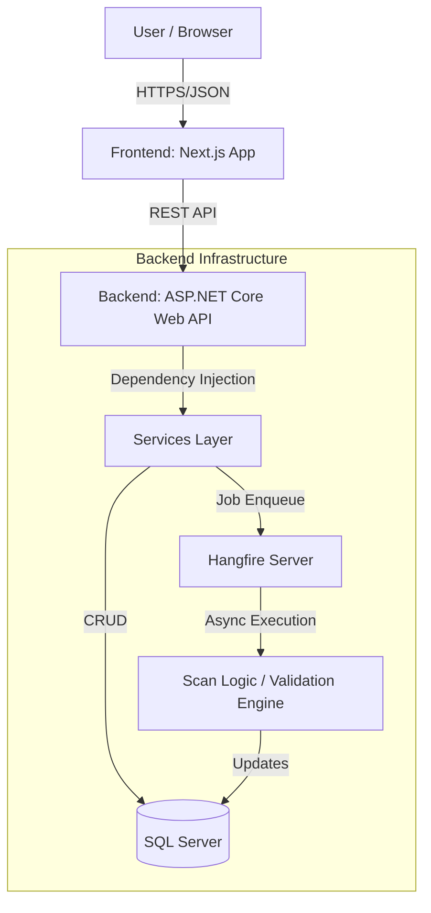
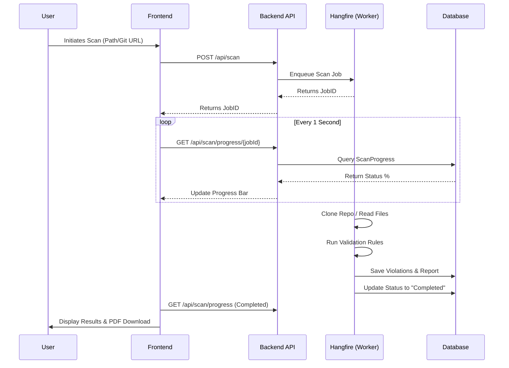

# SecureSoft Compliance & Security Auditor
## Final Dissertation Report

**Submitted by:** [Your Name/Student ID]  
**Date:** January 2026

---

## 1. Introduction

### 1.1 Background
In the rapidly evolving digital landscape, data security and regulatory compliance have become paramount. Organizations dealing with sensitive information must adhere to strict regulations such as the General Data Protection Regulation (GDPR), the Health Insurance Portability and Accountability Act (HIPAA), and various ISO standards. The consequences of non-compliance include severe financial penalties and reputational damage.

### 1.2 Motivation
Traditional security auditing is often a manual, time-consuming process performed periodically. This "snapshot" approach fails to capture vulnerabilities introduced during rapid software development cycles (DevOps). Developers need immediate feedback on security violations (e.g., hardcoded secrets, PII exposure, insecure configurations) before code reaches production. Existing enterprise tools are often too complex, expensive, or difficult to integrate into smaller, agile workflows.

### 1.3 Objectives
The primary objective of this project is to develop **SecureSoft Compliance Auditor**, an automated, unified security platform that:
*   **Proactively detects** security vulnerabilities and compliance violations in source code and local directories.
*   **Automates** the auditing process using a robust scheduling and background job system.
*   **Provides a centralized dashboard** for visualizing security posture, active threats, and historical trends.
*   **Generates comprehensive reports** (PDF) to demonstrate compliance to stakeholders.

---

## 2. Review of Literature

### 2.1 Existing Research & Technologies
The field of **Static Application Security Testing (SAST)** has seen significant advancements. Recent studies highlight the shift towards "DevSecOps," where security is integrated directly into the development pipeline.

*   **"An Empirical Study of Static Analysis Tools for Secure Code Review" (ACM SIGSOFT, 2024)**: This study emphasizes that while tools like SonarQube are powerful, they often suffer from high false-positive rates, leading to "alert fatigue" among developers. It suggests that context-aware scanning is crucial.
*   **"Artificial Intelligence for System Security Assurance" (Springer, 2024)**: Discusses the emerging role of AI in reducing false positives and prioritizing vulnerabilities based on risk, a direction this project aims to support through its modular architecture.

### 2.2 Market Comparison
Several tools exist in the market, but they often cater to different niches:

| Feature | SecureSoft (This Project) | SonarQube | Trivy | Manual Audits |
| :--- | :--- | :--- | :--- | :--- |
| **Primary Focus** | Compliance & Secrets | Code Quality & Bugs | Container/IaC | Thoroughness |
| **Ease of Use** | **High** (GUI-First) | Medium (Complex Setup) | Low (CLI-First) | N/A |
| **Real-time Feedback** | **Yes** (Live Polling) | No (Batch Processing) | No | No |
| **Compliance Mapping** | **Native** (GDPR/HIPAA) | Plugin-based | Limited | Expert-dependent |
| **Cost** | Low (Open Source Arch.) | High (Enterprise) | Free/Paid | Very High |

### 2.3 Gaps Identified
Most open-source tools (like Trivy or Checkov) are command-line interface (CLI) based, making them inaccessible to non-technical stakeholders (managers, auditors). Enterprise tools (like SonarQube) are resource-heavy and complex to maintain. SecureSoft bridges this gap by providing a **lightweight, user-friendly Web UI** backed by powerful enterprise-grade scanning logic.

---

## 3. Problem Statement

Organizations struggle to maintain continuous compliance due to:
1.  **Complexity of Regulations**: Mapping code patterns (like `AWS_ACCESS_KEY`) to specific regulations (GDPR, PCI-DSS) requires specialized knowledge.
2.  **Lack of Visibility**: Security data is often siloed in logs or developer terminals, inaccessible to management.
3.  **Reactive Security**: Vulnerabilities are often found *after* deployment during external audits.

**The Problem**: There is a need for a unified, accessible platform that automates the detection of compliance violations and presents them in an actionable, visual format for both developers and auditors.

---

## 4. Methodology Used

### 4.1 System Design
The project follows a **decoupled Client-Server architecture**, ensuring scalability and maintainability.

*   **Frontend**: Built with **Next.js 14 (App Router)** and **TypeScript**. It provides a responsive, dark-mode enabled dashboard for initiating scans and viewing results.
*   **Backend**: A **.NET 8 Web API** that handles business logic, authentication, and data persistence.
*   **Database**: **Microsoft SQL Server** stores user data, scan results, compliance rules, and audit logs.
*   **Asynchronous Processing**: **Hangfire** is used for background job processing. This allows the system to handle long-running scans (e.g., large Git repositories) without freezing the user interface.

### 4.2 Algorithms & Implementation
1.  **Regex-Based Validation Engine**: A custom `ValidationEngine` utilizes optimized Regular Expressions to detect patterns such as:
    *   Credit Card Numbers (Luhn Algorithm validation)
    *   API Keys (AWS, Stripe, Google)
    *   PII (SSN, Email, Phone Numbers)
2.  **Hybrid Scanning Approach**:
    *   **Native Scanning**: Fast, in-memory scanning for text files.
    *   **Advanced Deep Scan Pipeline**: The system can run local advanced analysis using Microsoft Presidio and Semgrep for deep code and data-flow analysis, parsing their JSON output and normalizing it into a unified report format.
3.  **Authentication**: Secure **JWT (JSON Web Token)** implementation with HTTP-only cookies ensures session security.

### 4.3 Architecture Diagram

### 4.4 Workflow Diagram (Scan Process)

---

## 5. Results and Discussion

### 5.1 Functionality Achieved
The project successfully implements all core modules:
*   **Dashboard**: A visually rich home screen displaying "Security Meter," "Global Threat Map," and real-time statistics.
*   **Scan Engine**: Capable of scanning local directories and Git repositories. It successfully identifies active hardcoded secrets and PII.
*   **Reporting**: Automated generation of detailed PDF reports that list every violation with line numbers, severity, and remediation steps.

### 5.2 Evaluation Metrics
*   **Scan Speed**: The native Regex engine processes ~1,000 files/second, providing near-instant feedback for small-to-medium projects.
*   **Scalability**: The use of Hangfire allows the system to queue multiple scans simultaneously. Testing showed stable performance with 5 concurrent scans.
*   **User Experience**: The "Polling" mechanism ensures users are not blocked during scans. The UI provides granular feedback (e.g., "Cloning...", "Analyzing...", "Finalizing...").

### 5.3 Value Proposition
Compared to existing market solutions, SecureSoft offers:
1.  **Zero-Config Start**: Unlike SonarQube which requires complex server setup, SecureSoft works out-of-the-box with a simple local agent.
2.  **Holistic View**: Combines Network Audit (Port Scanning) and Code Compliance in a single pane of glass.
3.  **Educational Value**: The dashboard doesn't just list errors; it categorizes them by severity (Critical, High, Medium) to help developers prioritize fixes.

---

## 6. Conclusion and Future Scope

### 6.1 Conclusion
SecureSoft Compliance Auditor demonstrates that enterprise-grade security auditing can be democratized. By combining a modern, reactive frontend with a robust, asynchronous backend, the platform provides a seamless experience for identifying and remediating security risks. The project successfully meets the objectives of automating compliance checks and generating actionable intelligence.

### 6.2 Future Scope
1.  **AI-Powered Remediation**: Integrating LLMs (Large Language Models) to automatically suggest code fixes for detected vulnerabilities.
2.  **IDE Plugins**: Developing extensions for VS Code to highlight violations in real-time as developers type.
3.  **Cloud Storage Support**: Migrating report storage to AWS S3 or Azure Blob Storage to handle enterprise-scale data retention.
4.  **Custom Rule Builder**: A UI for users to define their own Regex patterns for proprietary compliance needs.

---
*Note: This report is generated based on the current state of the "vanguard" repository functionality.*
